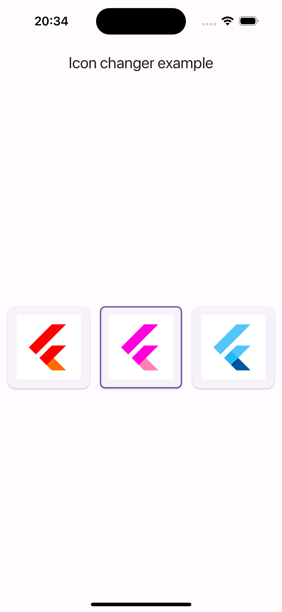

# Flutter App Icons Examples

## Description
This project demonstrates how to implement the functionality of changing icons in a Flutter application.



## Getting Started

To get started with the examples, clone the repository and navigate to the project directory:

```bash
git clone https://github.com/Vabiel/flutter_app_icon_changer.git
cd flutter_app_icon_changer
```

## Setup Android

1. Open `android/app/src/main/AndroidManifest.xml` and add an `activity-alias`:

```xml
<activity
    android:name=".MainActivity"
    android:exported="true"
    android:launchMode="singleTop"
    android:theme="@style/LaunchTheme"
    android:hardwareAccelerated="true"
    android:windowSoftInputMode="adjustResize">
    <meta-data
        android:name="io.flutter.embedding.android.NormalTheme"
        android:resource="@style/NormalTheme"
    />
    <intent-filter>
        <action android:name="android.intent.action.MAIN"/>
        <category android:name="android.intent.category.LAUNCHER"/>
    </intent-filter>
</activity>

<activity-alias
android:enabled="false"
android:exported="true"
android:icon="@mipmap/ic_launcher1"
android:name=".MainActivityAlias1"
android:targetActivity=".MainActivity">
<intent-filter>
    <action android:name="android.intent.action.MAIN" />
    <category android:name="android.intent.category.LAUNCHER" />
</intent-filter>
</activity-alias>

<activity-alias
android:enabled="false"
android:exported="true"
android:icon="@mipmap/ic_launcher2"
android:name=".MainActivityAlias2"
android:targetActivity=".MainActivity">
<intent-filter>
    <action android:name="android.intent.action.MAIN" />
    <category android:name="android.intent.category.LAUNCHER" />
</intent-filter>
</activity-alias>
```
Where `.MainActivityAlias1` and `.MainActivityAlias2` are the names of the aliases that will be accessed

2. Create new icons in the `android/app/src/main/res/mipmap-` folder named `ic_launcher_icon1` and `ic_launcher_icon2`(the names are specified in the `android:icon=` section of the manifest).

## Setup iOS

1. Open ios/Runner/Info.plist and add alternative icons:

```xml
<key>CFBundleIcons</key>
<dict>
    <key>CFBundlePrimaryIcon</key>
    <dict>
        <key>CFBundleIconFiles</key>
        <array>
            <string>AppIcon</string>
        </array>
    </dict>
    <key>CFBundleAlternateIcons</key>
    <dict>
        <key>Icon1</key>
        <dict>
            <key>CFBundleIconFiles</key>
            <array>
                <string>AppIcon1</string>
            </array>
        </dict>
        <key>Icon2</key>
        <dict>
            <key>CFBundleIconFiles</key>
            <array>
                <string>AppIcon2</string>
            </array>
        </dict>
    </dict>
</dict>
```
Where `.AppIcon`, `.Icon1` and `.Icon2` are the names of the assets that will be accessed.

2. Add alternative icons to the project in the `ios/Runner/Assets.xcassets` folder with the names specified in `Info.plist`
   **Important:** added assets must be of `appiconset` type.