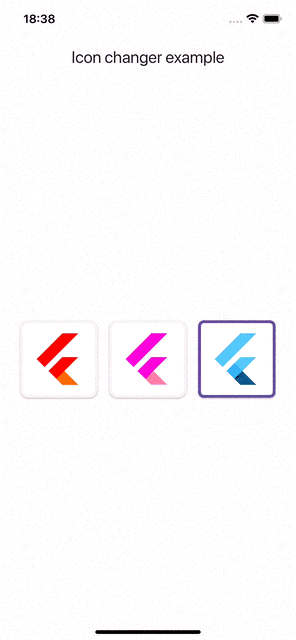

# Flutter App Icon Changer Example

## Description
This project demonstrates how to implement the functionality of changing app icons in a Flutter application for both Android and iOS platforms.

| Android                                                                              | iOS                                  |
|--------------------------------------------------------------------------------------|--------------------------------------|
|  |  |

## Getting Started

To get started with the examples, clone the repository and navigate to the project directory:

```bash
git clone https://github.com/Vabiel/flutter_app_icon_changer.git
cd flutter_app_icon_changer
```

## Setup

### Adding Assets to pubspec.yaml

Ensure that your icon assets are properly declared in your pubspec.yaml file, so they can be used within your Flutter application.

```yaml
flutter:
  assets:
    - assets/icons/
```

### Setup Android

To enable changing app icons in your Android application, follow these steps:

1.	**Modify AndroidManifest.xml:**
Open the file android/app/src/main/AndroidManifest.xml and add an <activity-alias> for each alternate icon you wish to use.

```xml
<!-- Main Activity -->
<activity
    android:name=".MainActivity"
    android:exported="true"
    android:launchMode="singleTop"
    android:theme="@style/LaunchTheme"
    android:hardwareAccelerated="true"
    android:windowSoftInputMode="adjustResize">
    <meta-data
        android:name="io.flutter.embedding.android.NormalTheme"
        android:resource="@style/NormalTheme"
    />
    <intent-filter>
        <action android:name="android.intent.action.MAIN"/>
        <category android:name="android.intent.category.LAUNCHER"/>
    </intent-filter>
</activity>

<!-- Alternate Icon 1 -->
<activity-alias
    android:name=".MainActivityAlias1"
    android:enabled="false"
    android:exported="true"
    android:icon="@mipmap/ic_launcher1"
    android:targetActivity=".MainActivity">
    <intent-filter>
        <action android:name="android.intent.action.MAIN" />
        <category android:name="android.intent.category.LAUNCHER" />
    </intent-filter>
</activity-alias>

<!-- Alternate Icon 2 -->
<activity-alias
    android:name=".MainActivityAlias2"
    android:enabled="false"
    android:exported="true"
    android:icon="@mipmap/ic_launcher2"
    android:targetActivity=".MainActivity">
    <intent-filter>
        <action android:name="android.intent.action.MAIN" />
        <category android:name="android.intent.category.LAUNCHER" />
    </intent-filter>
</activity-alias>
```

**Explanation:**
* .MainActivityAlias1 and .MainActivityAlias2 are the names of your activity aliases that will be used to switch icons.
* android:icon specifies the icon resource to be displayed.
* android:enabled="false" means the alias is disabled by default and will be enabled programmatically when changing icons.

2.	**Add Alternate Icons:**
Create new icon files in the android/app/src/main/res/mipmap- folders with the names ic_launcher1.png and ic_launcher2.png. These names should match the android:icon values in your <activity-alias> entries.

**Example folder structure:**

```
android/app/src/main/res/
    mipmap-mdpi/
        ic_launcher.png
        ic_launcher1.png
        ic_launcher2.png
    mipmap-hdpi/
        ic_launcher.png
        ic_launcher1.png
        ic_launcher2.png
    ...
```

**Tips:**
* Ensure the icons are of the correct dimensions for each screen density.
* You can use icon generators to simplify this process.

3.	**Update build.gradle (if necessary):**
Make sure the minimum SDK version is set to 21 or higher in your android/app/build.gradle file:

```gradle
defaultConfig {
    applicationId "com.example.flutter_app_icon_changer"
    minSdkVersion 21
    targetSdkVersion 33
    // ...
}
```

4.	**Clean and Rebuild the Project:**
After making these changes, run the following commands:

```bash
flutter clean
flutter pub get
flutter run
```

### Setup iOS

To enable changing app icons in your iOS application, follow these steps:

1.	**Add Alternate Icons to Assets:**
Open your project in Xcode:

```bash
open ios/Runner.xcworkspace
```

**In Xcode:**
* Navigate to Runner/Assets.xcassets.
* Right-click and select **New App Icon** for each alternate icon you want to add.
* Name the new app icons exactly as specified in your Info.plist (e.g., AppIcon1, AppIcon2).
* Add the icon images of appropriate sizes to each app icon set.
**Important:** The icons must be of the AppIcon type (app icon sets), not regular image sets.

2.	**Modify Info.plist:**
Open the file ios/Runner/Info.plist and add the alternate icons under the CFBundleIcons key:

```xml
<key>CFBundleIcons</key>
<dict>
    <key>CFBundlePrimaryIcon</key>
    <dict>
        <key>CFBundleIconFiles</key>
        <array>
            <string>AppIcon</string>
        </array>
    </dict>
    <key>CFBundleAlternateIcons</key>
    <dict>
        <key>Icon1</key>
        <dict>
            <key>CFBundleIconFiles</key>
            <array>
                <string>AppIcon1</string>
            </array>
        </dict>
        <key>Icon2</key>
        <dict>
            <key>CFBundleIconFiles</key>
            <array>
                <string>AppIcon2</string>
            </array>
        </dict>
    </dict>
</dict>
```
**Explanation:**
* CFBundlePrimaryIcon defines the default app icon (AppIcon).
* CFBundleAlternateIcons contains a dictionary of alternate icons.
* Keys Icon1 and Icon2 are identifiers for your alternate icons used in the code.
* CFBundleIconFiles contains an array of icon names corresponding to the sets in Assets.xcassets.

3.	**Ensure Naming Consistency:**
Make sure the names in Info.plist match exactly with the icon set names in Assets.xcassets.

4.	**Rebuild the Project:**
After making the changes, run:

```bash
flutter clean
flutter pub get
flutter run
```

### Usage

After setting up the platforms, you can use the icon-changing functionality in your Flutter application.

#### Example Usage

```dart
import 'package:flutter/material.dart';
import 'dart:async';

import 'package:flutter/services.dart';
import 'package:flutter_app_icon_changer/flutter_app_icon_changer.dart';
import 'package:flutter_app_icon_changer_example/src/models/models.dart';

void main() {
  runApp(const MyApp());
}

class MyApp extends StatefulWidget {
  const MyApp({super.key});

  @override
  State<MyApp> createState() => _MyAppState();
}

class _MyAppState extends State<MyApp> {
  final _flutterAppIconChangerPlugin = FlutterAppIconChangerPlugin(
    iconsSet: CustomIconsSet(),
  );

  CustomIcon _currentIcon = CustomIcons.defaultIcon;
  var _isSupported = false;

  @override
  void initState() {
    super.initState();
    initPlatformState();
  }

  Future<void> initPlatformState() async {
    _isSupported = await _flutterAppIconChangerPlugin.isSupported();
    if (_isSupported) {
      final currentIcon = await _flutterAppIconChangerPlugin.getCurrentIcon();

      if (!mounted) return;

      setState(() {
        _currentIcon = CustomIcon.fromString(currentIcon);
      });
    }
  }

  @override
  Widget build(BuildContext context) {
    return MaterialApp(
      home: Scaffold(
        appBar: AppBar(
          title: const Text('Icon changer example'),
        ),
        body: Column(
          children: <Widget>[
            const Spacer(),
            if (!_isSupported) ...[
              const Text('Changing the icon is not supported on this device'),
              const SizedBox(height: 8),
            ],
            FittedBox(
              child: Opacity(
                opacity: _isSupported ? 1 : .5,
                child: Padding(
                  padding:
                      const EdgeInsetsDirectional.symmetric(horizontal: 24),
                  child: Row(
                    mainAxisAlignment: MainAxisAlignment.center,
                    children: [
                      _buildIcon(CustomIcons.redIcon),
                      const SizedBox(width: 8),
                      _buildIcon(CustomIcons.purpleIcon),
                      const SizedBox(width: 8),
                      _buildIcon(CustomIcons.defaultIcon),
                    ],
                  ),
                ),
              ),
            ),
            const Spacer(),
          ],
        ),
      ),
    );
  }

  Widget _buildIcon(CustomIcon icon) {
    final border = BorderRadius.circular(8.0);

    return InkWell(
      borderRadius: border,
      onTap: _isSupported ? () => _changeIcon(icon) : null,
      child: Card(
        shape: icon == _currentIcon ? _buildBorder(border) : null,
        child: Padding(
          padding: const EdgeInsets.all(4.0),
          child: _buildPreviewIcon(
            icon,
          ),
        ),
      ),
    );
  }

  OutlinedBorder _buildBorder(BorderRadius borderRadius) {
    return RoundedRectangleBorder(
      borderRadius: borderRadius,
      side: BorderSide(
        color: Theme.of(context).primaryColor,
        width: 4.0,
      ),
    );
  }

  Widget _buildPreviewIcon(CustomIcon icon, {double size = 100}) {
    return ClipRRect(
      borderRadius: BorderRadius.circular(8),
      child: Image.asset(
        icon.previewPath,
        fit: BoxFit.contain,
        width: size,
        height: size,
      ),
    );
  }

  Future<void> _changeIcon(CustomIcon icon) async {
    final currentIcon = icon.currentIcon;
    try {
      await _flutterAppIconChangerPlugin.changeIcon(currentIcon);
      setState(() {
        _currentIcon = icon;
      });
    } on PlatformException catch (e) {
      debugPrint("Failed to change icon: '${e.message}'.");
    }
  }
}
```
## Additional Notes

**Testing on Emulators:**
Changing app icons may not work on some emulators or simulators. It’s recommended to test on real devices.

**Platform Compatibility:**
* Android: Requires API level 21 (Android 5.0) or higher.
* iOS: Supported on iOS 10.3 and above.

**Permissions:**
* No additional permissions are required to change app icons.

## Troubleshooting

**Icons Not Changing:**
* Verify that the icon names are consistent across your code and configuration files.
* Ensure that the icons are correctly added to the project resources.

**Build Errors:**
* Run flutter clean and rebuild the project.
* Check for syntax errors in AndroidManifest.xml and Info.plist.

**Icon Changing Not Supported:**
* Confirm that you are testing on a supported platform.
* Ensure that the minimum SDK version meets the requirements.
